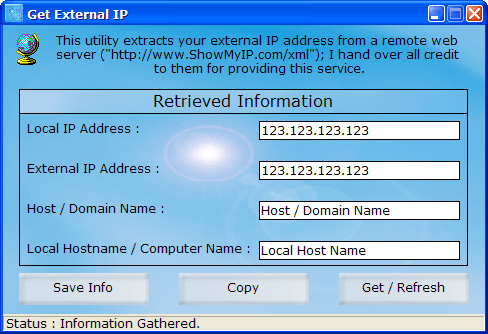



## Get External IP

### Description

This is a redo of my previous version. If you are behind a router/hub/NAT/firewall and are unable to get your "real" IP address, then you can use this simple utility. It extracts your IP address and hostname ("ISP Name") from a remote web server ("http://www.ShowMyIP.com/xml"); therefor I cannot take full credit for this; but give it to them for providing the service. Comments, threats, jokes are always appreciated! :)
 
### More Info
 

             |
---                |---
**Submitted On**   |2003-03-06 07:52:04
**By**             |[Daniel W\. Elkins](https://github.com/Planet-Source-Code/PSCIndex/blob/master/ByAuthor/daniel-w-elkins.md)
**Level**          |Beginner
**User Rating**    |5.0 (20 globes from 4 users)
**Compatibility**  |VB 3\.0, VB 4\.0 \(16\-bit\), VB 4\.0 \(32\-bit\), VB 5\.0, VB 6\.0
**Category**       |[Complete Applications](https://github.com/Planet-Source-Code/PSCIndex/blob/master/ByCategory/complete-applications__1-27.md)
**World**          |[Visual Basic](https://github.com/Planet-Source-Code/PSCIndex/blob/master/ByWorld/visual-basic.md)
**Archive File**   |[Get\_Extern155528362003\.zip](https://github.com/Planet-Source-Code/daniel-w-elkins-get-external-ip__1-43790/archive/master.zip)

